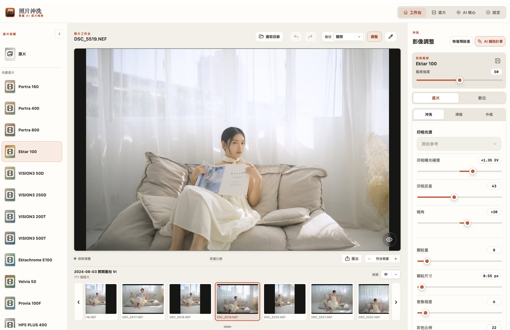

# FilmDevelop — 사진 현상

[繁體中文](README.md) · [English](README.en.md) · [日本語](README.ja.md) · [한국어](README.ko.md)



Apple Silicon Mac용 필름 스타일 사진 편집기입니다. 사진 폴더를 열고 필름을 선택한 뒤 현상, 스캔, 밝기와 색상을 조정하여 내보내세요. 사진 편집과 AI 보조 조정은 로컬에서 실행됩니다.

macOS 14 이상이 필요합니다. AI 기능은 별도로 다운로드하는 호환 로컬 모델이 필요합니다.

## 다운로드 및 언어

[GitHub Releases](https://github.com/VaderChen/FilmDevelop/releases/latest)에서 Apple Silicon용 DMG를 다운로드하여 열고 `照片沖洗.app`을 응용 프로그램 폴더로 드래그하세요. 정식 설치 파일은 Developer ID 서명과 Apple 공증을 완료했습니다.

번체 중국어, 영어, 일본어, 한국어를 지원합니다. 설정에서 선택하거나 시스템 언어를 자동 감지할 수 있습니다. 기본 메뉴, 대화상자, 필름 설명, 도움말, 진행 상태도 함께 바뀝니다. 파일 이름, 사용자 지정 필름 이름, 사용자 프롬프트는 원문을 유지합니다.

## 주요 기능

- **필름 컬렉션:** 컬러 네거티브, 영화용 네거티브, 슬라이드, 흑백, 즉석 필름, 특수 프로세스를 제공합니다. 기본적으로 모두 선택되며 작업 공간에 표시할 항목을 바꿀 수 있습니다. 사이드바 접기 상태도 기억합니다.
- **원본:** 컬렉션 첫 항목은 필름 효과 없이 원본 노출과 계조에서 편집을 시작합니다.
- **현상 및 스캔:** 입자, 현상, 글로우, 할레이션, 노출, 대비를 조정합니다. 중성 스캔 또는 따뜻한 중간 영역과 차가운 밝은 영역을 선택합니다.
- **디지털 조정:** 전체, 밝은 영역, 중간 영역, 어두운 영역을 따로 조정합니다.
- **자르기 및 회전:** 원본 비율, 자유 자르기, 일반 비율을 지원하며 모서리 바깥을 드래그하여 회전합니다.
- **실행 취소 및 다시 실행:** 폴더 선택 옆 버튼을 사용합니다. 연속적인 슬라이더 드래그는 한 단계로 기록됩니다.
- **사진별 기억:** 필름 선택, 수동 조정, AI 결과를 사진마다 저장합니다. 다시 열어도 AI를 자동 실행하지 않습니다.
- **프레임 및 날짜:** 두 조정 모드에서 테두리와 레트로 카메라 날짜를 추가합니다.

## 시작하기

1. 폴더를 선택하고 썸네일에서 사진을 열거나 사진을 드래그합니다.
2. 왼쪽에서 필름 또는 원본을 선택합니다.
3. 오른쪽에서 필름 또는 디지털 모드를 선택합니다. 필름에는 현상·스캔·프레임, 디지털에는 전체·밝은 영역·중간 영역·어두운 영역·프레임이 있습니다.
4. 필요하면 AI 보조 조정을 실행하거나 수동으로 조정합니다.
5. 결과를 내보냅니다. 썸네일이 아닌 원본 사진에서 계산합니다.

### 탐색 및 미리보기

썸네일은 세 가지 크기로 제공되며 보이는 범위만 불러옵니다. 로딩 중에는 회전 표시가 나타납니다. 화살표는 한 장, 휠은 세 장 간격으로 스크롤하며 편집 중인 사진은 바꾸지 않습니다. 마지막 폴더, 사진, 썸네일 위치를 기억합니다.

미리보기에서 휠로 확대·축소하고 왼쪽 버튼으로 드래그하여 이동합니다. 최소 배율은 창에 맞춤입니다. 스페이스 키 또는 비교 버튼을 누르는 동안 원본을 표시합니다. 사진을 0.8초 누르면 왼쪽 위에 RGB 히스토그램이 나타나며 ×로 닫습니다. 히스토그램은 현재 미리보기를 기준으로 합니다.

사이드바 필름 위에 마우스를 올리면 작은 이미지로 효과를 미리 볼 수 있습니다. 접힌 아이콘과 사용자 지정 필름도 지원합니다. 마우스를 옮기거나 창을 바꾸면 원래 사진으로 돌아갑니다. 미리보기는 편집 기록, 빨간 표시, 내보내기에 영향을 주지 않으며 클릭해야 적용됩니다.

### 자르기

끄기, 원본 비율, 자유 자르기, 일반 비율을 제공합니다. 원본 비율은 원본의 가로세로 비율을 고정하고, 고정 비율은 사진 방향에 맞춰집니다.

프레임 안에서 이동하고 핸들로 크기를 바꾸며 모서리 바깥에서 회전합니다. 완료로 적용합니다. 취소 또는 끄기는 이번에 확정하지 않은 변경만 버리고 이전에 완료한 자르기는 유지합니다.

자르기는 일반 편집과 같은 창 맞춤 방식의 빠른 미리보기를 사용합니다. 완료 후 원본에서 계산하며 표시용 미리보기의 긴 변은 최대 2048px입니다.

### 조정 및 AI

필름 강도의 기본값은 50입니다. 원본을 포함한 모든 기본 필름은 중성 스캔이 기본으로 켜져 있습니다. 스캔 중에도 현상에서 노출과 대비를 조정할 수 있습니다. 양수 노출은 밝게, 음수는 어둡게 합니다. 스캔에서는 색 농도, 색층 분리, 플레어, 중간·밝은 영역의 온도를 조정합니다.

사진을 열기만 하면 AI가 실행되지 않습니다. 호환 로컬 모델을 선택한 뒤 AI 보조 조정을 실행하세요. 취소하거나 결과를 수동 조정할 수 있습니다. 실제 사진을 보며 결과를 판단하세요.

슬라이더 조정 영역을 두 번 클릭하면 해당 값만 현재 필름의 기본값으로 돌아갑니다. 다른 항목은 유지되며 실행 취소할 수 있습니다.

기본값 복원은 현재 필름 조정을 초기화하고 실행 취소·다시 실행 기록과 썸네일 빨간 표시를 지웁니다. 사용자 지정 필름은 저장된 설정으로 돌아갑니다. 새 편집은 다시 실행 기록을 지웁니다. 기록은 현재 사진 편집 세션에서만 유지되며 사진 전환이나 재시작 후에는 없어지지만 사진 조정값은 저장됩니다.

### 설정 및 개인정보

기능 설명은 기본적으로 켜져 있습니다. 제목 위에 마우스를 올려 설명을 볼 수 있으며 자동 표시를 꺼도 제목을 클릭하면 볼 수 있습니다. 원본 해상도 편집을 켜면 편집 해상도가 높아지고 끄면 더 가볍게 작업할 수 있습니다. 두 모드 모두 원본에서 내보냅니다.

사진, 모델, 조정 기록은 로컬에 저장합니다. 모델 검색·다운로드와 업데이트 확인에는 인터넷이 필요하지만 다운로드한 모델로 분석할 때 사진을 업로드하지 않습니다. 고급 사용자는 로컬 외부 제어 서비스를 켜거나 끌 수 있습니다. 연결 설정에는 액세스 토큰이 있으므로 공유하거나 커밋하지 마세요.

### 앱 업데이트

설정 제목과 같은 줄의 오른쪽 끝에 있는 업데이트 확인 버튼으로 GitHub의 최신 정식 Release를 확인합니다. 다운로드 진행률과 크기가 표시되며 취소할 수 있습니다. 완료 후 설치 파일을 검증하고 사진 조정을 저장한 뒤 업데이트하고 다시 시작합니다.

실행 시에도 백그라운드에서 확인하여 새 버전이 있을 때만 알립니다. 오프라인이거나 릴리스가 없어도 편집을 방해하지 않습니다. 업데이트하려면 쓰기 가능한 응용 프로그램 폴더에 설치하세요. 버전 형식은 대만 시간 기준 `1.YY.MMdd build HHmm`이며 예시는 `1.26.0924 build 0109`입니다.

업데이트는 [FilmDevelop Releases](https://github.com/VaderChen/FilmDevelop/releases)에서 가져옵니다. 공개 저장소와 설치 파일이 포함된 정식 Release가 필요합니다. 태그는 `v1.YY.MMdd-build-HHmm`, 파일은 `FilmYourPhoto-1.YY.MMdd-build-HHmm-arm64.dmg`입니다. 로컬 패키징 도구가 빌드 버전에 맞춰 이름을 생성합니다.

## 소스에서 실행

```sh
git clone --recurse-submodules https://github.com/VaderChen/FilmDevelop.git
cd FilmDevelop
./run.command
```

전체 Xcode가 필요하며 최초 준비 시 빌드 의존성을 다운로드할 수 있습니다. Finder에서 `run.command`를 두 번 클릭해도 됩니다. 앱 내 업데이트는 자동 재시작하지만 소스에서 다시 빌드한 경우 기존 앱을 종료하고 실행하세요.

## 추가 설명

필름과 스캐너 외관은 시뮬레이션이며 개별 제품의 제조사 실측을 재현한 것은 아닙니다.

테스트, 연구 문서(`doc/`, `docs/`), 빌드·임시 파일은 개발자 로컬에 보관하며 공개 저장소에 포함하지 않습니다. 필요한 서브모듈은 기록되며 `run.command`가 호출하는 스크립트가 빌드 산출물을 생성합니다.

미리보기를 오른쪽 클릭하여 실행 취소, 다시 실행, 초기화, 히스토그램, 원본 비율·자유 자르기, 내보내기, Finder에서 보기, 휴지통으로 이동을 사용할 수 있습니다.

PNG는 기본적으로 투명도가 없는 8비트 RGB입니다. 투명한 가장자리는 미리보기와 같은 검정 배경으로 채웁니다.

내보내는 동안 중앙의 큰 대화상자에서 검정 배경 위로 사진이 천천히 나타납니다. 사진 크기, 형식, 이전 소요 시간, 실제 처리·저장 진행에 맞춰 움직이며 저장 후에 완성된 사진을 보여 줍니다. 빠른 출력도 약 7초의 현상 효과를 유지하지만 파일 저장은 애니메이션을 기다리지 않습니다.

편집한 썸네일에는 빨간 점이 표시되며 초기화하면 사라집니다. 원본에서도 스캔, 색 농도, 플레어, 온도를 조정할 수 있습니다. 미리보기 갱신 후 자르기 오른쪽의 스포이트로 회색 또는 흰색을 선택하여 화이트 밸런스를 보정하세요. Esc로 취소합니다.

강도 위의 저장 아이콘으로 모든 조정을 이름 붙여 사용자 지정 필름으로 저장합니다. 카드의 삭제는 설정만 제거하며 이미 사진에 적용된 조정은 유지합니다. 재실행 후에도 사용할 수 있고 이후 사진 편집은 저장한 설정을 덮어쓰지 않습니다. 전환 시 기본 필름 조정도 보존됩니다. 라이브러리는 사용자 지정·기본 필름을 구분하며 작업 공간은 원본, 사용자 지정, 기본 순서입니다. 접힌 아이콘도 클릭할 수 있습니다.

## 라이선스

Copyright (C) 2026 VaderChen. [소스 공개·상업적 판매 금지 라이선스](LICENSE.ko.md)는 무료 취득, 사용, 연구, 수정, 무료 공유를 허용하며 회사·조직 내부 사용도 포함합니다. 소프트웨어 판매, 유료 호스팅·SaaS, 유료 서비스, 유료 제품 통합, 설치·맞춤화·지원·유지보수 명목의 과금은 금지합니다.

금지된 판매·영리 활동에는 저작권자의 별도 서면 허가가 필요하며 문의 자체는 허가가 아닙니다. [상업적 판매 정책](COMMERCIAL-LICENSE.md)을 참고하세요. 판매 제한이 있는 소스 공개 라이선스이며 OSI 정의의 오픈 소스라고 주장하지 않습니다.

전체 약관: [繁體中文](LICENSE.md) · [English](LICENSE.en.md) · [日本語](LICENSE.ja.md) · [한국어](LICENSE.ko.md). 번역이 다르면 번체 중국어 원문이 우선합니다.

타사 라이브러리와 모델에는 각자의 라이선스가 적용됩니다. [타사 라이선스 안내](THIRD_PARTY_NOTICES.md)를 참고하세요. 앱 사용으로 사용자 사진과 출력 이미지에 소프트웨어 라이선스가 적용되지는 않습니다. 약관은 [YourDesk](https://github.com/VaderChen/YourDesk/blob/539f3f266cc31cce6958f08826bc27653c98282f/LICENSE.md)를 바탕으로 프로젝트 이름을 FilmDevelop로 변경했습니다.
