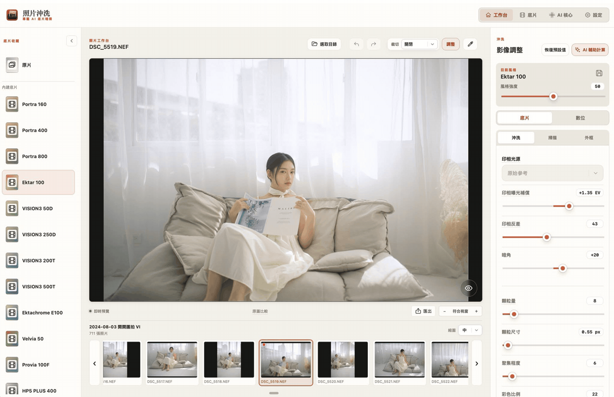

# FilmDevelop — 照片沖洗

[繁體中文](README.md) · [English](README.en.md) · [日本語](README.ja.md) · [한국어](README.ko.md)



為 Apple Silicon Mac 設計的底片照片編輯器。從照片目錄開始，選一款底片，調整沖洗、掃描與明暗，再匯出成品。照片編輯與 AI 輔助計算都在本機進行。

支援 macOS 14 以上；AI 功能需另備相容的本機模型。

## 功能特色

- **底片收藏**：提供彩色負片、電影負片、反轉片、黑白、即影即有與特殊製程。預設全部選取，可自行決定哪些出現在工作台；左側收藏可收合並記住狀態。
- **原片**：收藏第一項保留原始曝光與色調，不套用底片效果，方便從原始外觀開始編輯。
- **沖洗與掃描**：調整顆粒、顯影、柔光、紅暈、曝光與反差；掃描可呈現中性外觀，或暖中調、冷亮部的色彩。
- **數位微調**：分成整體、亮部、中調、暗部，細調照片不同區域的明暗與色彩。
- **裁切與旋轉**：支援原始比例、自由裁切及常用比例；拖動裁切框外側邊角可旋轉照片。
- **修復筆刷**：調整筆刷大小，塗抹要移除的物件，放開滑鼠後自動以本機 AI 補齊背景；支援取消處理與復原。
- **復原與重做**：用選取目錄旁的上一步、下一步按鈕回復調整；連續拖曳一次滑桿算一步。
- **照片各自記憶**：切換照片後，保留各張照片的底片選擇、手動調整與 AI 結果；再次開啟不會自動重跑 AI。
- **外框與日期**：加入相框與復古相機日期印字，兩種調整模式都可使用。

## 下載與語言

從 [GitHub Releases](https://github.com/VaderChen/FilmDevelop/releases/latest) 下載 Apple Silicon 版 DMG，開啟後將「照片沖洗」拖入「應用程式」。正式安裝檔使用 Developer ID 簽章並完成 Apple 公證。

介面支援繁體中文、English、日本語與 한국어，可在設定切換或依系統自動偵測。原生選單、對話框、底片說明、操作提示及處理進度會同步切換；照片檔名、自訂底片名稱與使用者提示詞保留原文。

## 開始使用

1. 按「選取目錄」，從下方縮圖開啟照片；也可拖入照片。
2. 在左側選擇底片，或選「原片」保留原始外觀。
3. 右側選擇「底片」或「數位」。底片模式有「沖洗、掃描、外框」，數位模式有「整體、亮部、中調、暗部、外框」。
4. 視需要按「AI 輔助計算」，或直接手動調整。
5. 按「匯出」儲存成品。匯出從原始照片計算，不使用縮圖取代原圖。

### 瀏覽與預覽

縮圖有小、中、大三種尺寸，只載入目前看得到的範圍，載入時顯示轉圈動畫。左右按鈕每次移動一張的距離；滑鼠在縮圖列上滾動則每次移動三張，不會切換正在編輯的照片。上次目錄、照片與縮圖瀏覽位置會保留。

在照片預覽區用滾輪放大或縮小，放大後可按住左鍵拖曳。最小維持「符合視窗」；按住空白鍵或比較按鈕可查看原圖。在照片上按住 0.8 秒，可於左上角顯示 RGB 三原色直方圖，按 × 關閉；圖表取自目前顯示的預覽。

在左側底片列表停留滑鼠，可用小尺寸照片快速預覽該款底片；收合後的圖示與自訂底片也適用。移開滑鼠或切換視窗即恢復目前照片，不新增編輯步驟、不標記紅點，也不影響匯出。點選底片才正式套用。

預覽會重用未變動的來源圖片，僅傳送更新的成品；顆粒與紅暈共用乳劑運算結果，減少滑桿調整時的重複處理，維持原有 FP32 精度。

拖曳滑桿時先更新最長邊 1024 px 的快速預覽，放開 0.5 秒後再更新處理圖；放大與平移位置保持不變。載入照片會先顯示快速預覽與處理動畫，再換成實際結果。若預覽解碼失敗，可按「重新載入預覽」重試。

### 裁切

裁切選單依序提供「關閉、原始比例、自由裁切」及常用比例。「原始比例」會鎖定原圖的長寬比；固定比例會配合照片直橫向顯示。

選比例後拖曳裁切框移動、拖曳控制點改變範圍，或從外側邊角旋轉。按「完成」套用；按「取消」或選「關閉」會放棄本次尚未完成的變更，保留先前已完成的裁切。

裁切時使用快速預覽，底圖與一般編輯採相同的符合視窗方式。完成後從原圖計算，顯示預覽最長邊上限為 2048 px。

### 修復筆刷

按照片上方、裁切左側的橡皮擦圖示，在頂部導覽列的筆刷卡片調整大小，在原片上塗抹要移除的物件，放開滑鼠按鍵即自動修復。處理失敗或取消後可重新塗抹；完成後按「完成」回到目前的底片與裁切效果。已套用的修復可以用上一步／下一步復原與重做，並隨照片儲存，預覽與匯出都會套用，原檔保持不變。

首次修復會下載約 217 MB 的 LaMa 修復模型，會彈出下載進度對話框，顯示實際百分比與已下載／總 MB，可隨時取消。下載完成後顯示模型準備動畫，模型就緒即自動關閉對話框並繼續修復。模型準備好後可離線使用，照片不會上傳。Apple Silicon 使用 Core ML 的 CPU／GPU 加速。修復依周圍內容補圖，細小物件通常較適合；大範圍移除可能出現細節模糊或不自然的紋理，請放大檢查結果。

修復後執行 AI 輔助計算，分析與人物辨識會使用已修復的照片。切換照片或恢復預設值後，先前尚未完成的辨識結果不會覆蓋目前照片。

### 調整與 AI

底片強度預設 50，所有內建底片（含原片）預設開啟中性掃描。掃描開啟時，仍可在「沖洗」調整曝光與反差；曝光正值變亮、負值變暗。「掃描」專注於色彩濃度、色層分離、雜散光及中調／亮部冷暖。

讀取照片不會立刻執行 AI。準備好模型後，按「AI 輔助計算」才開始；可取消，也可再手動微調結果。AI 判斷可能不同，請以實際照片為準。請先在模型設定中選擇相容的本機模型。

雙擊個別滑桿的調整區域，可將該項數值恢復為目前底片的預設值，其他項目不變，並可用上一步復原。

「恢復預設值」可重設目前底片的調整，立即清除照片已套用的修復筆刷結果，並清空上一步／下一步紀錄及縮圖紅點；自訂底片會回到儲存時的參數。「上一步／下一步」可復原與重做；更改參數後會清除原本的重做分支。歷程目前限本次照片編輯，切換照片或重開 App 後不保留，但已完成的照片參數會保存。

「膚色冷暖」位於數位整體調整的鏡頭模糊與美白之間；−100 偏冷、+100 偏暖，0 為中性，只在膚色遮罩內作用，並支援照片各自儲存、復原與恢復預設值。

磨皮使用保留邊緣的導向濾波，在膚色遮罩內平滑細小紋理，不需額外下載模型。膚色及背景模糊的人物遮罩改用完整 RGB 聯合導向濾波，讓美白、冷暖與模糊效果沿照片色彩邊界收斂，減少跨邊界滲漏。磨皮與 HDR 也修正了濾波視窗大小，避免部分預覽尺寸下的磨皮強度幾乎沒有作用。去雜訊先於底片顆粒處理，避免互相抵消；暗角補償採用角落曝光增益，保留純黑及原有反差。

遮罩細化依據 [Guided Image Filtering（TPAMI 2013）](https://people.csail.mit.edu/kaiming/publications/pami12guidedfilter.pdf) 與 [Fast Guided Filter（2015）](https://arxiv.org/abs/1505.00996) 自行實作。大圖在最長邊 1024 px 內估計係數，再以完整解析度照片重建邊界；這是內部遮罩運算，不改變處理圖與匯出解析度。人物辨識漏掉的肢體或物件仍可能需要進一步處理，遮罩細化無法取代辨識模型。

HDR 不依賴 AI 提供色調曲線也能手動調整；模擬鏡頭模糊已改善裁切後的深度對齊與主體邊緣滲色。匯出按鈕改為陶紅底、白色文字與圖示。

### 設定與隱私

「顯示功能說明」預設開啟，滑鼠停在標題時顯示說明泡泡；可關閉自動提示並記住偏好，關閉後仍可點擊標題查看說明。「使用原檔編輯」預設關閉，採用最長邊 2048 px 的處理圖；開啟可提高編輯解析度，效能不足的設備建議保持關閉。兩者匯出皆從原檔處理。

照片、模型與調整紀錄保存在本機。搜尋、下載模型與檢查 App 更新需要網路；使用已下載模型分析照片不需上傳照片。進階使用者可啟用或停用本機外部控制服務。連線設定含存取權杖，請勿分享或提交到版本庫。

### App 更新

「設定」標題右側的「檢查更新」會查詢 GitHub 最新正式 Release。有新版時可下載並更新，下載視窗顯示百分比與檔案大小，也可取消。下載完成後會驗證安裝檔、保存照片調整、更新 App 並重新開啟。

每次開啟 App 也會在背景檢查，有新版才提醒；離線或尚未發布版本時不打擾編輯。請將 App 安裝在可寫入的「應用程式」資料夾後使用更新功能。版本顯示為 `1.YY.MMdd build HHmm`，例如 `1.26.0923 build 2350`，日期與時間採台灣時間。

更新來源為 [FilmDevelop 的 GitHub Releases](https://github.com/VaderChen/FilmDevelop/releases)。儲存庫需公開並發布含安裝檔的正式 Release，更新功能才有版本可下載。發布時，Release 標籤使用 `v1.YY.MMdd-build-HHmm`，安裝檔名稱為 `FilmYourPhoto-1.YY.MMdd-build-HHmm-arm64.dmg`；本機打包工具會依建置版本自動產生對應名稱。

若早期版本在下載後顯示「更新未完成」，可從 [GitHub Releases](https://github.com/VaderChen/FilmDevelop/releases/latest) 下載安裝檔，關閉舊版後重新安裝一次；已儲存的照片調整與自訂底片會保留。新版已改善 App 改名後的更新相容性，並會依實際問題顯示提示。

## 取得與啟動

```sh
git clone --recurse-submodules https://github.com/VaderChen/FilmDevelop.git
cd FilmDevelop
./run.command
```

需要完整 Xcode；首次準備可能需下載建置相依項目。也可以在 Finder 雙擊 `run.command`。使用 App 內的更新功能時會自動重新開啟；從原始碼重新建置後，請先結束舊版 App。

## 補充說明

底片與掃描外觀是模擬，並非特定掃描器或每款底片的原廠量測重現。

測試、研究文件（`doc/`、`docs/`）及建置／暫存產物只保留於開發者本機，不包含在公開版本中。正式建置所需的第三方子模組仍隨版本庫記錄，建置產物由 `run.command` 呼叫的腳本產生。

最新修正與驗證摘要見[更新紀錄](CHANGELOG.md)。已在 macOS 27.0 驗證 Canon EOS 5D Mark IV 的 CR2、EOS R 的 CR3，以及 Sony α7 III 壓縮／未壓縮 ARW 的完整解碼、預覽與匯出；其他相機與系統版本仍依 macOS RAW 支援情況而定。

在照片顯示區按右鍵，可使用上一步、下一步、恢復預設值、顯示直方圖，以及原始比例或自由裁切；也可匯出照片、在 Finder 顯示目前檔案，或將檔案移到垃圾桶。

PNG 預設以 8-bit RGB 匯出，不含透明度；透明邊緣會填入與預覽相同的黑底。

匯出時，畫面中央的大型對話框會從黑底慢慢顯影，呈現沖洗底片的感覺。顯影節奏會參考照片大小、輸出格式與過往實際耗時，配合照片處理和儲存的進度；完成儲存後才完全顯現成品，並稍作停留。較快的輸出也會保留約 7 秒的顯影過程，檔案儲存不需等待動畫。

縮圖左上角的紅點標示已調整的照片，恢復預設值後會清除。原片也能套用掃描風格、色彩濃度、雜散光與冷暖調整。預覽更新完成後，裁切右側的白平衡滴管可點選照片中的灰色或白色區域校正色溫與色偏，按 Esc 取消取樣。

點選強度數值上方的儲存圖示，可將目前所有調整命名為自訂底片。自訂底片卡片上的「刪除」可移除不再需要的配方，已套用到照片上的調整會保留。自訂底片會保存在這部 Mac，重新開啟後仍可套用；後續編輯照片不會覆寫已儲存的配方，切換自訂底片也會保留內建底片原有的調整。底片庫以分隔線區分上方自訂、下方內建底片；工作台將原片置頂，再列自訂與內建底片。側欄收合後保留可點選的底片圖示。


印相光源在掃描與正片模式下也可調整，採用成品光源色彩補償；選擇「原始參考」維持原有色調。非掃描負片仍使用光譜印相流程。

## 授權

本專案採用[原始碼公開・禁止商業販售授權](LICENSE.md)，Copyright (C) 2026 VaderChen。允許免費取得、使用、研究、修改與免費分享，包含公司或組織內部自用；禁止販售軟體、付費代管／SaaS、收費服務、付費產品整合，以及以安裝、客製、支援或維護等名義收費。

若需進行授權所禁止的販售或營利安排，請與著作權人另行討論並取得書面授權；洽詢本身不構成授權。詳見[商業販售政策](COMMERCIAL-LICENSE.md)。本授權含商業販售限制，屬原始碼公開授權，不宣稱符合 OSI 開源定義。

完整條款：[繁體中文](LICENSE.md) · [English](LICENSE.en.md) · [日本語](LICENSE.ja.md) · [한국어](LICENSE.ko.md)。翻譯如有差異，以繁體中文全文為準。

第三方程式庫與模型保留各自原始授權，詳見[第三方授權說明](THIRD_PARTY_NOTICES.md)。使用者照片與匯出影像不因使用本程式而被套用本軟體授權。授權條款沿用 [YourDesk](https://github.com/VaderChen/YourDesk/blob/539f3f266cc31cce6958f08826bc27653c98282f/LICENSE.md)，專案名稱改為 FilmDevelop。
