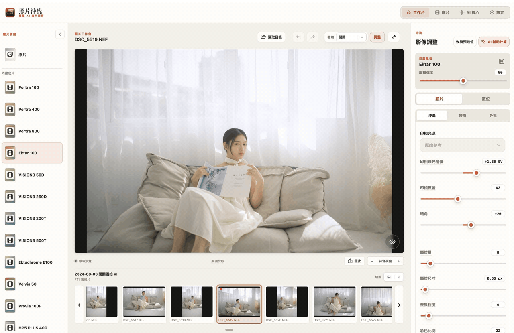

# FilmDevelop — 照片沖洗

把照片調成喜歡的底片味道。選一款底片，再調整曝光、色彩與顆粒，就能匯出自己的作品。

[繁體中文](README.md) · [English](README.en.md) · [日本語](README.ja.md) · [한국어](README.ko.md)



## 下載使用

[下載 Mac 與 Windows 版](https://github.com/VaderChen/FilmDevelop/releases/latest)。目前版本：**1.26.1003 build 0924**，Windows 標示 **Beta**。

| 平台 | 安裝方式與需求 |
| --- | --- |
| macOS | Apple Silicon、macOS 14 以上。開啟 `macos-arm64.dmg`，將 FilmDevelop 拖進「應用程式」。本次 DMG 及內含 App 已完成 Developer ID 簽章、Apple 公證與票證附加。 |
| Windows Beta | Windows 10／11 x64，完整解壓 `windows-x64-portable.zip` 後執行 `FilmDevelop.exe`。內附 VC++ x64 Runtime，仍需 WebView2；主程式未簽署 Authenticode。 |

舊 Windows setup 版首次改用 ZIP 需手動下載並解壓至新資料夾；設定與照片調整會沿用，之後可在免安裝版內更新。ZIP 不保證消除 Windows 來源提示。

兩個平台共用繁體中文、英文、日文與韓文介面。舊 Swift Mac 版可使用「檢查更新」直接升級；FilmYourPhoto 過渡包會在第一次開啟時，將原安裝位置轉為標準 FilmDevelop 身分，不需第二次下載。完成後，後續更新只使用 FilmDevelop；過渡期仍保留舊 Swift 與先前相容包的升級入口。安裝後會沿用可辨識的照片調整、星級、分類與自訂底片，既有新版資料優先。換電腦可在設定中「匯出資料庫／匯入並重新定位」；資料包不含原始照片，舊紀錄缺少原路徑時需重新定位。

<!-- release-summary:start -->
## 本次更新

相較版本：**1.26.1003 build 0018**。

- **修正**：補上 Nikon HE／HE* NEF 與 GoPro GPR 的共同解碼流程：系統或 LibRaw 缺少解碼器時，使用已安裝的 Adobe DNG Converter 建立無損 RAW 快取，支援 Mac 與 Windows。
- **新增**：缺少補充解碼器時，在照片下方提供 Adobe 官方下載與重新偵測入口；使用者需自行完成原廠安裝。FilmDevelop 不內附 Adobe Converter，一般預覽不自動跳出安裝對話框。
- **修正**：GPR 加入照片匯入及兩平台 RAW 辨識；沒有可用內嵌縮圖時也能補充解碼，安裝後重新偵測可恢復列表縮圖。
- **改善**：補充解碼保留原始照片、調整識別與拍攝 EXIF；快取有內容驗證、容量上限、取消與結束清理。完整感光資料仍由共用 LibRaw 顯影，不以相機 JPEG 取代編輯來源。
- **改善**：補驗 Mac 47 張 RAW 的 141 次預覽／匯出、Windows 20 張的 60 次工作及預設系統模式 42 次工作；公開 EXIF、尺寸及像素差異紀錄。未知格式、JPEG XL／Enhanced DNG 與逐像素一致性仍有限制。

[完整更新紀錄](CHANGELOG.md)
<!-- release-summary:end -->

## 特色

- **從底片到成品都能玩**：模擬感色層、乳劑顆粒、顯影藥水、印相紙與掃描，一路調整成像與質感。
- **經典風格，也能調出自己的味道**：Portra、Ektar、VISION3、Velvia、黑白與特殊底片，加上 GR III／GR IV 相機模擬；喜歡的設定可存成自訂底片。
- **每張照片都有自己的設定**：保留各張的調整、裁切與修復，隨時比較原圖；匯出從原檔計算，不覆蓋原始照片。
- **本機處理，AI 由你決定何時使用**：照片與調整留在電腦，下載模型後可離線分析與修復，也可以完全手動調整。

## 功能一覽

| 功能 | 可以怎麼用 |
| --- | --- |
| 底片收藏與自訂 | 收藏、排序、調整風格強度；自訂底片可改名、複製、匯入與匯出。 |
| 顯影與底片質感 | 調整顯影時間、溫度、攪拌、反差、顆粒、柔光與紅暈；進一步玩感色層、乳劑、互易律與銀鹽密度。 |
| 掃描與印相 | 選擇掃描器模擬、底片或相片掃描，搭配亮面、霧面、暖調纖維紙，調整印相光源與冷暖。 |
| RAW 與明暗色彩 | 保留原片曝光與白平衡，支援相容 RAW 的鏡頭修正；可用白平衡滴管、分區曝光、反差、鮮豔度、飽和度與 HDR。 |
| 人像與細節 | 磨皮、美白、膚色冷暖、背景與鏡頭模糊，搭配去雜訊和暗角補償。 |
| 即時預覽 | 滑鼠停在底片上先試看，放大檢查細節、比較原圖，也能查看 RGB 直方圖。 |
| 構圖與修復 | 自由或固定比例裁切、旋轉、AI 修復筆刷、外框與日期印字；支援復原與重做。 |
| 照片整理 | 縮圖複選、星級、自訂分類、排序與篩選，查看 EXIF，快速開啟最近使用的目錄。 |
| 複製與批次處理 | 複製照片並保留調整，複製參數套用到多張照片，也能批次恢復原片與匯出。 |
| 匯出設定 | JPEG、PNG、WebP、TIFF；PNG／TIFF 可選 8／16 bit，支援尺寸、品質及 sRGB、Adobe RGB、Display P3；「寫入 EXIF」預設開啟，保留原始拍攝資訊。 |
| AI 與外部工具 | 手動啟動 AI 輔助分析與調整；進階使用者可開啟本機 MCP，連接支援的外部工具。 |

## 四步開始

1. 按「選取目錄」，挑一張照片。
2. 選喜歡的底片，或用「原片」開始調整。
3. 看著預覽微調；不滿意可以復原，也能隨時比較原圖。
4. 按「匯出照片」。多張照片可以一起匯出，各自保留自己的調整。

照片與調整紀錄留在本機。AI 模型首次使用需下載，準備好後可離線使用。

## 設定小提醒

RAW 與計算加速預設使用 **系統**，選項會保存並在啟動時重新偵測。Mac 使用 Apple 原生加速；Windows 優先採用通過實際探測的 Vulkan GPU，無法使用時回退 CPU。系統 RAW 解碼失敗時，使用內建 LibRaw 備援。

Nikon HE／HE* NEF、GoPro GPR 等缺少解碼器的來源，可使用另外安裝的免費 [Adobe DNG Converter](https://helpx.adobe.com/camera-raw/desktop/dng-and-file-formats/adobe-dng-converter.html) 自動建立無損 RAW 快取。未安裝時，照片下方會提供官方下載與重新偵測；Adobe 程式不內附於 FilmDevelop。原始照片與拍攝 EXIF 會保留。

本版在 Mac 驗證 47 張 RAW、Windows 驗證 20 張及 14 張預設系統模式樣本，包含 NEF／GPR 缺失格式。成功解碼不代表所有 RAW、HDR 範圍或兩平台每個像素都相同；JPEG XL／Enhanced DNG 尚未驗收。詳細範圍、部署條件與差異見 [RAW 補充解碼紀錄](engine/verification/raw/supplemental-decoder.md)。

底片與相機風格是模擬效果，並非原廠預設或 LUT。更多操作提示可直接點選 App 內的功能標題查看。

<details>
<summary>想從原始碼執行？</summary>

`run.command` 建置並啟動 **Go／Wails 主程序 + Swift／C++ 影像引擎**。Go 管理 UI、照片、配方、設定、模型、MCP、更新及匯出；macOS 硬體計算由 Swift／C++ 負責，Windows 由 C++ 負責。一般本機建置使用 ad-hoc 簽章；正式簽章、公證與 Windows 免安裝 ZIP 建置方式見 [Go 桌面說明](desktop/README.md)。

需要 Go 1.25 以上、Python 3.9 以上、完整 Xcode，以及 CMake、glslang、Vulkan headers／loader 和 MoltenVK；詳細相依項目見[建置說明](Vendor/PhotoCompute/README.md#建置與部署)。

```sh
git clone --recurse-submodules https://github.com/VaderChen/FilmDevelop.git
cd FilmDevelop
./run.command
```

</details>

## 授權

Copyright © 2026 VaderChen。可依[授權條款](LICENSE.md)免費使用、修改與分享；禁止商業販售及以本軟體提供收費服務，詳見[商業販售政策](COMMERCIAL-LICENSE.md)。照片與匯出作品不受本軟體授權限制，第三方元件依[各自授權](THIRD_PARTY_NOTICES.md)提供。
