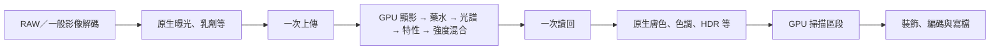

# 整體計算 Review 與 GPU 常駐修正

日期：2026-09-30。環境：Apple M4 Pro／macOS 27.0。範圍涵蓋 RAW 輸入、App 共用影像管線、Vulkan 中介層及成品編碼；本輪未建置 Windows。

## 已確認並修正

### App 的傳輸方式與獨立測試不一致

原本 App 在每次顯影、藥水、光譜、底片特性呼叫中，各自將 Core Image 轉成 CPU RGBAf、上傳 Vulkan、執行，再下載到 CPU。獨立 C++ 測試則讓這些階段的影像常駐 GPU。單階段 shader 的時間因此無法代表 App 的實際運算成本。

現在使用 ABI 2 的 schema 2 計算圖。Swift 中介層提供節點及相依影像索引，C++ 在同一裝置上依序執行；中間影像不回 CPU。支援分支，底片強度混合保留的基底、必要的 RAW 亮部映射與灰階同樣在 GPU 完成。原生路徑保留原處理順序，既有單階段 C ABI 則保留為對照入口。

每個節點只能引用根影像或較早的節點；會先驗證索引及版本，再運算。以最後使用者計數歸還不再需要的 Surface，錯誤時 RAII 清理整張圖。中性顯影／藥水會在建立計算圖時略過。

真實 runtime 的影像傳輸計數（不含 LUT／參數）：

| 四個連續階段 | 上傳 | 讀回 | 中間影像 |
| --- | ---: | ---: | --- |
| 原本逐階段介面 | 4 | 4 | 每階段經 CPU |
| 新計算圖 | 1 | 1 | 保留在 GPU |

`photo_compute_plan_verify` 使用同一來源及參數，四階段結果最大 Float32 差值為 0；另驗證帶透明度的分支混合、20 次非法相依及失敗後復原。`photo_compute_transfers` 從實際 `Context::upload`／`download` 計數，並核對 bytes，並非只數 Swift 呼叫次數。

App 仍包含未移植的原生階段，交換邊界如下；不能為了少一次傳輸而把掃描移到色調調整之前。

### 全尺寸顯影取樣差異

既有 App Smoke 以 192／512 px 驗證，未充分涵蓋 6048×4032 的顯影場縮小。本輪補測高顯影量、藥水顆粒／銳度、旋轉、耦合、掃描暖色的完整 PNG16 成品，發現 3 個像素 ΔE00 ≥ 2，最大 2.55295337141。停用顯影後降至 1.10030857297，停用藥水顆粒仍超標，將差異定位到顯影。

以獨立 Core Image 取樣與脈衝測試確認：

- 本機 Metal 線性取樣器使用 1/256 權重；CPU／Vulkan 原本使用完整浮點插值。
- CILanczosScaleTransform 大幅縮小會先分段減半，再做末段 Lanczos。6048 → 768 的原生單次呼叫，與原生兩次 0.5 再一次 0.507936… 的脈衝結果相同；直接用一次 Lanczos 的脈衝響應不同。

CPU 與 Vulkan 已對齊這兩項行為，並保留奇數尺寸的原始目標範圍。**沒有調低顯影強度、減少迭代或放寬 ΔE 門檻。** 完整 24,385,536 像素的 PNG16 成品，最大 ΔE00 降為 **1.59049477438**，沒有像素 ≥ 2。

## 實際時間的解讀

同一張 6048×4032 NEF、Portra 400 複合參數、匯出路徑，使用 App 共用入口及實際編碼器：

| 工作 | 修改前 Vulkan | 修改後 Vulkan | 同輪原生 |
| --- | ---: | ---: | ---: |
| 影像渲染 | 4.039 s | 2.663 s | 3.654 s |
| PNG16 編碼 | 3.130 s | 3.086 s | 3.100 s |
| JPEG 編碼 | 0.110 s | 0.106 s | 0.109 s |
| PNG 渲染＋編碼＋寫檔 | 7.195 s | 5.778 s | 6.770 s |

這是同機單次診斷對照，並非固定 GPU 時脈、隨機順序、多次取中位數的正式效能基準。初始化、RAW 解碼另計；色差比較與 PFM 儲存不計入時間。兩次測試並非冷快取狀態相同，數字只代表此案例，不宣稱所有底片固定加速多少。

此例渲染初測減少約 34%，但 PNG 編碼本身仍約 3.1 秒。編碼與其他共用原生工作足以稀釋局部演算法的差距，符合「實際匯出感受不像階段測試差那麼多」的觀察。JPEG 與 PNG 的瓶頸比重不同，不能只用一種格式推算。

## 最終驗證

| 範圍 | 數量 | 結果 |
| --- | ---: | --- |
| App 原有完整處理成品 | 53 | 最大 ΔE00 0.323385406905 |
| 512 px 複合參數，預覽／匯出 | 4 | 最大 ΔE00 1.20384976288 |
| 6048×4032 RAW 複合參數完整成品 | 1 | 最大 ΔE00 1.59049477438 |
| Vulkan 大型／奇數尺寸三模組 | 18 | 最大 ΔE00 1.49653673044 |
| CPU 大型／奇數尺寸三模組 | 18 | 最大 ΔE00 1.49653709938 |

Xcode Debug 建置通過。13 項核心／Vulkan CTest 通過，另有 App 常駐計算圖回歸測試。新增原生脈衝參考的回歸檢查，防止將分段縮小退回一次縮小。

重跑渲染、切換、錯誤與 RAW 生命週期 Smoke，追蹤的 provider、engine、管線與 RAW bytes 最後皆歸零。`leaks` 仍為先前可在純原生管線重現的 Core Image 4 個配置／384 bytes；沒有宣稱整個程序零 leak，詳見 [記憶體檢查報告](MEMORY_AUDIT.md)。

原始證據：

- 修改前全尺寸：`build/compute-review-Tlps7V/`；修改後：`build/compute-review-8Q7FBK/`。
- App 53 組：`build/compute-integration-30vjJE/report.json`；512 px：`build/compute-edge-Uyl3x2/report.json`。
- 傳輸次數：`build/compute-review/plan-test.json`；CTest：`build/compute-review/ctest.log`。
- CPU／Vulkan 幾何矩陣：`build/compute-review/*-regression.json`。
- 生命週期：`build/compute-memory-756jGl/swift-memory.json`、`leaks.log`。
- 原生取樣語意：`build/compute-review/interpolation.swift`、`lanczos.swift`；App 整體測試：本機 `Tests/macOS/ComputeReviewSmoke.swift` 與 `scripts/review-compute.sh`。

本輪未對所有照片、所有參數組合、所有 GPU／作業系統做窮舉。RAW 解碼、未移植的 Core Image 運算、編碼與寫檔仍各有成本；GPU 常駐已套用於相鄰 Vulkan 計算，不代表整個 App 已完全使用 Vulkan。
