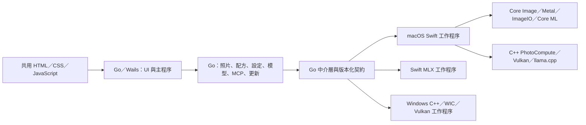

# Go 桌面宿主與跨平台進度

更新日期：2026-10-03，版本 **1.26.1003 build 1503**。`run.command` 建置並開啟 **Go／Wails 主程序＋Swift／C++ 影像引擎**。Go 共用 UI、照片、配方、設定、資料移轉、模型、MCP、更新與匯出流程；macOS 使用 Swift／Apple 框架及 C++，Windows 使用 C++／WIC／Vulkan。

macOS 支援 Apple Silicon、macOS 14 以上；Windows 支援 10／11 x64，版本文字附 **Beta**。兩平台均已接通底片、編輯、RAW 備援、AI 分析與修復、匯出及資料移轉；平台差異與實測界線列於文末。

前一版 build 1300 納入 [第一輪 13 項移植修正](SWIFT_PARITY_AUDIT.md)，再修正 [第二輪 12 項功能與 UI 缺漏](SWIFT_PARITY_SECOND_AUDIT.md)，並處理 Windows AI 模型格式與具名 mmproj 配對。Windows 直接隱藏 MLX 選項，使用 GGUF；macOS 保留 MLX。外接磁碟 JPEG、單張顯影與複選匯出一併納入回歸，正式成品驗證見 [還原紀錄](RESTORATION.md)。

本版的最佳化詳見 [函式層級效率與記憶體報告](FUNCTION_EFFICIENCY.md)：涵蓋配方編輯、遮罩、模型配對、照片排序、自訂底片預設及 CPU Gaussian，列出 22 種 Go 輸入與兩平台原生量測，以及逐位元、匯出和 UI 回歸證據。完整數值見 [量測資料](function-efficiency-report.json)。

## 分工



Go 管理業務規則、資料、排程與程序生命週期；Swift／C++ 負責影像和硬體計算。MLX 使用同一套 Go 推論介面，直接呼叫既有 Swift MLX 工作程序。共用配方操作不需要啟動原生程序。

| 模組 | 混合宿主現況 |
| --- | --- |
| 目錄與列表 | 選目錄、自然排序、可視縮圖、損壞檔案、空目錄、最近目錄、切換與重開恢復。 |
| 編輯 | 37 個既有風格與 1 個隱藏相容配方、119 個控制項、裁切、完整復原／重做、白平衡滴管、校準檔、懸停預覽、設定保存、系統選單與快捷鍵。 |
| 照片與底片管理 | 自訂底片匯入／匯出／改名／複製／刪除，四語提示詞，星級、分類、EXIF、複製照片、批次套用／重設／匯出、移到垃圾桶。 |
| 模型與 AI | GGUF／MLX 探索、配對、驗證、匯入、Hugging Face 搜尋／下載／取消；完整 AI 配方在 Go 驗證並映射。 |
| 修復與主體 | Go 管理模型下載、筆刷工作、取消與紀錄；macOS 使用 Core ML／系統主體遮罩，Windows 使用 ONNX／DirectML，均保留高精度修復貼片。 |
| 補充 RAW 解碼 | Nikon HE／HE*、GPR 等已辨識但缺少解碼器的來源，透過使用者安裝的 Adobe DNG Converter 建立無損 RAW 快取，再交給同一 LibRaw 處理；缺少工具時先自動確認，再用預設瀏覽器開啟 Adobe 官方下載頁；取消後仍保留照片下方入口與重新偵測。詳見 [部署與限制](../engine/verification/raw/supplemental-decoder.md)。 |
| 預覽顯影 | 先顯示列表同一張縮圖，再將已套用參數的影像由 0→100% 不透明度漸進顯露；等待文字、轉圈與主體偵測取消按鈕固定在照片下方。 |
| 匯出 | JPEG、PNG、WebP、TIFF，8／16 bit 與色彩空間、尺寸、品質設定；從原圖重新計算，拍攝 EXIF 預設回填，可關閉。 |
| MCP | 本機 HTTP 服務與 12 項工具，Bearer 權杖、來源檢查、取消、編輯序列化及 UI 完成確認。 |
| 更新 | Go 查詢版本、以進度條顯示下載、驗證下載與平台套件；macOS 共用原有可回復安裝助手，Windows 優先使用免安裝 ZIP，驗證後替換原目錄，新版啟動失敗時還原。 |

## 契約與資料

- `engine/contract/protocol.json` 產生 Go／Swift／C++ 傳輸型別。配方保留 schema 12，Go 支援 schema 1–12 遷移；未知版本不會靜默降級。
- `internal/recipes` 是底片預設、控制項、遷移、Web 投影及 AI 配方映射的共同來源。資料最初取自實際 Swift 產物；`prompts.json` 與 `plan.json` 保留既有提示詞契約。
- 原生端提供 capabilities、render、preview、thumbnail、whiteBalance、metadata、rawProbe、reveal、trash、analysis、infer、prepareRepair、repair；另有唯讀的 macOS 舊偏好設定遷移入口。原生端仍驗證傳入資料。
- 預覽透過序列 JSONL 工作階段重用目前照片的 Swift 解碼影像、編輯縮圖、主體遮罩及原圖比較。來源內容、解析器、鏡頭設定及相關參數改變時使對應快取失效；閒置 45 秒或關閉宿主時收回程序。取消時丟棄過期結果，讓 GPU 工作安全收尾，超過 30 秒才強制終止。
- Go 另外保留最近 6 份、總計最多 32 MiB 的顯影成品，切回照片／底片可直接重用；來源內容 SHA-256 與完整運算設定共同識別，快取不參與正式匯出。Web 狀態只傳送有變更的影像，重新連線會完整同步，清除照片時明確清空舊圖。
- 首次照片仍從列表縮圖以 650 ms 漸進顯影；同張照片切換底片或更新參數改用 180 ms 過渡，減少結果已完成但仍在等待動畫的時間。
- 匯出、AI 等其他原生工作使用獨立程序。stdout 僅輸出 JSONL 進度及結果，stderr 留作診斷；單則訊息上限 **64 MiB**，足以承載既有修復貼片。Go 等待工作完成或程序退出後，才清理暫存。
- 一次預覽工作共用解碼影像，回傳顯影、裁切與原圖比較結果；Web 預覽沿用舊 Swift 的 JPEG 品質 0.88。拖曳時使用 1024 px 編輯縮圖，放開後回到原有 2048 px／原尺寸運算設定；原生浮點影像計算與正式匯出精度不變。
- 拖曳持續更新影像，Go 只保留一份執行中的工作與最新待處理參數；最後縮圖完成後再補清晰圖。手勢結束才保存照片紀錄，單次參數更新只重新投影該底片。桌面橋接確認指令已入列後才送下一筆，確保最後參數、放開與換圖的順序。
- Swift 同時保留目前照片最近兩種尺寸的處理圖與原圖比較，避免反覆切換 1024／2048 px 時重新縮放。RAW 與計算加速均預設 `system`；明確選取的後端保存於 Go 設定，重啟後恢復，寫入失敗則保留原有選項。
- 加速選單由原生能力資料產生，啟動時核對持久化選項；不再提供未安裝的解析器或未通過探測的 GPU。Windows 的 `system` 先驗證 Vulkan 1.1 以上、GPU 計算能力與實際運算，再自動使用 GPU；無可用 GPU 或運算失敗時，從原圖重新執行 CPU 管線，UI 顯示實際選擇；macOS 繼續使用系統原生運算。
- PNG16／TIFF16 由原生端直接寫入，不經 Go 降成 8 bit。成品先寫入暫存，成功後以不可覆寫移動發布；macOS 檔案系統不支援特殊改名旗標時，改用排他建立及有界串流複製。儲存對話框已確認取代，或 MCP 明確要求覆寫時，共用原目標變更檢查，並禁止覆寫來源照片。
- 照片紀錄以**標準化路徑＋內容 SHA-256** 識別，同內容副本保持獨立。Go 使用裸雜湊，讀取原 Swift PhotoEdits 時使用含 `sha256:` 前綴的識別碼；亦相容先前 Go 的純內容紀錄，不改寫舊 Swift 資料。先前漏讀產生的「原片、無參數、歷史不完整」紀錄可自動恢復；Go 已有調整或明確重設的紀錄優先。
- 設定、自訂底片、模型選擇、提示詞、最近目錄、星級及分類分開保存。修復貼片在每張照片文件只存一份，避免在 37 款配方中重複儲存。切換照片與關閉視窗會提交前端暫存編輯；關閉要求與最後一批參數使用同一筆指令，避免事件先後順序造成漏存。
- Windows 使用 `%APPDATA%\FilmDevelop`；macOS 為保留既有資料仍使用 `~/Library/Application Support/FilmDevelop-GoDevelopment`。這是資料相容路徑，不是產品標示。`FILMDEVELOP_DATA_DIR` 可指定隔離目錄。
- `FILMDEVELOP_ENGINE` 可指定原生執行檔；一般封裝使用相對於 App 的引擎及資源位置，不依賴啟動目錄。

C++ 計算 ABI 維持頂列在前、預乘 RGBA Float32、extended-linear sRGB。這不表示 LibRaw 路徑已保留所有 RAW 高光餘量；目前軟體 RAW 仍經 RGB16 解碼。

## 建置與驗證

從儲存庫根目錄執行。需要 Go 1.25 以上、Python 3.9 以上、完整 Xcode，以及現有 C++／Vulkan 相依工具。macOS 首次建置會準備 llama.cpp 與 MLX。Windows 另需 MinGW-w64 x64、Ninja、Vulkan headers、glslangValidator、7zz 與 msiextract；只有舊 NSIS 封裝模式需要 makensis。

```sh
./run.command

# 僅建置，及建立本機 macOS DMG
bash scripts/build-desktop-macos.sh
python3 scripts/package-macos.py

# Windows x64 交叉編譯、免安裝 ZIP 封裝及靜態檢查
bash scripts/build-windows-package.sh

python3 scripts/prepare-desktop.py
go -C desktop vet ./...
go -C desktop test -race ./internal/...
python3 engine/contract/generate.py --check
node --check PhotoStyleApp/Web/app.js
node --check desktop/frontend/bridge.js

python3 engine/verification/smoke.py > build/engine-smoke-latest.json
python3 engine/verification/desktop-smoke.py
python3 engine/verification/parity-smoke.py
python3 engine/verification/parity-smoke.py --unsupported-rename
python3 engine/verification/preview-cache-smoke.py
```

產物：

- `build/desktop/FilmDevelopGo.app`
- `dist/macos-arm64/FilmDevelop-<版本>-build<組建>-macos-arm64.dmg`（現有混合版）
- `dist/macos-arm64/FilmYourPhoto-<版本>-build-<組建>-arm64.dmg`（舊 Swift／舊識別 Go 的一次性移轉入口）
- `dist/windows-x64/FilmDevelop-<版本>-build<組建>-windows-x64-portable.zip`

配方移植以 **1,957 項 Swift 參考案例** 驗證。此次另執行真實原生渲染、Wails UI、MCP HTTP、實際 MLX 模型、Core ML 修復、PNG16 匯出及安裝套件驗證。逐項結果與限制見 [功能恢復紀錄](RESTORATION.md)。

完整 PhotoStyleShared 舊測試仍有 20 個失敗斷言；隔離基線確認修改前後相同，未列為整套通過。這與已通過的移植金樣本、45 項桌面及 15 項引擎 Smoke 分開記錄。

實際模型 Smoke 使用四個明確環境變數啟用，平時單元測試不下載或執行模型：`FILMDEVELOP_NATIVE_SMOKE_ENGINE`、`FILMDEVELOP_NATIVE_SMOKE_IMAGE`、`FILMDEVELOP_NATIVE_SMOKE_MODEL`、`FILMDEVELOP_NATIVE_SMOKE_REPAIR`。指定後執行 `go -C desktop test -v ./internal/application -run '^TestNativeRestoration$' -count=1 -timeout=10m`。

舊照片還原 Smoke 使用 `FILMDEVELOP_LEGACY_SMOKE_DIRECTORY`、`FILMDEVELOP_NATIVE_SMOKE_ENGINE`、`FILMDEVELOP_NATIVE_SMOKE_IMAGE`，執行 `go -C desktop test -race -v ./internal/application -run '^TestLegacyPhotoNativeSmoke$' -count=1 -timeout=4m`。可另指定 `FILMDEVELOP_LEGACY_SMOKE_GO_DATA` 唯讀複製既有空白 Go 紀錄，及 `FILMDEVELOP_LEGACY_SMOKE_OUTPUT` 保存預覽與匯出。所有還原紀錄寫入隔離測試目錄，原圖和 Swift 資料只讀。

預覽效能量測使用 `FILMDEVELOP_PERF_ENGINE`、`FILMDEVELOP_PERF_IMAGE`、`FILMDEVELOP_PERF_OUTPUT`，執行 `go -C desktop test -v ./internal/application -run '^TestPreviewPerformanceSmoke$' -count=1 -timeout=5m`；分別測量編輯縮圖與原尺寸模式的開圖、切換底片及連續曝光調整，所有紀錄寫入隔離目錄。結果見 `preview-performance-report.json`（本機 `build/preview-performance-report.json`）。

真實滑桿量測與順序驗證：`python3 engine/verification/editing-preview-smoke.py /照片絕對路徑.NEF --verify --report build/editing-preview-after.json`。改用 `--preferences` 會以同一隔離資料目錄啟動兩次，驗證系統預設與加速選項持久化。量測使用非 race 建置；一般桌面 Smoke 仍使用 race。結果與限制見 `editing-performance-report.json`（本機 `build/editing-performance-report.json`）。

照片／底片切換的完整 UI 量測使用 `python3 engine/verification/preview-navigation-smoke.py <照片一> <照片二> --report <報告.json>`。兩張原檔只讀並複製到隔離目錄，記錄指令送出至結果抵達、影像解碼與動畫完成的時間，另確認切回時的成品一致。量測不使用 race 插樁；結果見 `preview-navigation-report.json`（本機 `build/preview-navigation-report.json`）。

## Swift 整理

`run.command` 不再建置或啟動舊 SwiftUI 桌面。catalog、normalizeRecipe、editRecipe、projectRecipes 已從 Swift RPC 移除，改由 Go 提供。

原應用儲存器與 Web 投影已隔離至 `LegacyStyleAdjustmentStore.swift`；混合 App 不編譯此相容檔，也不編譯舊 WebCoordinator、模型管理、MCP、更新管理及原生 UI 映射。共用 LLM 與影像分析來源使用 `FILMDEVELOP_GO_HOST` 排除舊提示詞／AI 業務編排，只提供 Go 所需的推論與像素分析。裁切預覽的配方方法移至原生資料模型，解除對舊 UI 協調器的依賴。

舊 Xcode 桌面與測試保留作相容性比對，不參與混合 App 執行。`PhotoStyle.swift` 保留影像模型與輸入驗證，`PhotoStyleShared` 保留 Core Image／Metal／Core ML 演算法。

## 資料移轉、平台驗證與發布

啟動時立即顯示等待對話框；首次從 FilmYourPhoto 移轉時，列出設定、舊照片紀錄保存、目錄掃描與調整移轉等階段。有確定總量時顯示實際處理數與階段進度條，未知總量時顯示轉圈及經過時間。完成後自動關閉並開放操作，較晚載入的介面也可取得最新進度。

首次啟動讀取舊 Swift 設定、自訂底片、星級、分類、照片配方與主體遮罩；逐欄與逐項保存來源指紋及移轉收據。新版既有值、已刪除項目與明確還原優先，避免重複移轉覆蓋。舊檔案原樣封存，損壞項目個別隔離。設定頁可查看移轉紀錄，匯出資料庫，或匯入並重新定位。匯出包不包含原照片或 MCP 權杖；僅有舊雜湊而缺少路徑的紀錄需要使用者協助定位。

build 1109 的啟動／移轉與共用對話框在 Mac WKWebView、Windows 10 WebView2 各通過 119 項檢查；Mac 另通過 47 項一般功能 Smoke。正式 DMG、公證、舊 Swift 識別移轉及 Windows ZIP 解壓／Runtime／GUI／更新交接與還原皆有本次成品證據；模擬更新子程序被 Defender 攔截，改用完整正式 App 完成補驗，原失敗紀錄與方法詳見[本版驗證紀錄](RESTORATION.md)。

已在 Windows 10 x64／GTX 1060 實機驗證 JPEG／RAW、CPU／Vulkan、全部既有配方、裁切與裝飾、色彩空間、EXIF、16 bit 匯出、GGUF 圖文推論及 ONNX LaMa 修復。Mac 使用 MLX Qwen 與 Core ML LaMa 驗證同一 Go 流程。304 組 Swift 影像參考在兩平台 CPU／GPU 共 1,216 組比較通過；主體、景深、降噪與日期字形不在該逐像素門檻內。最新 UI 及資料移轉另有實際 Wails／WebView2 Smoke，詳見 [功能恢復紀錄](RESTORATION.md)。

先前 44 份、17 品牌、31 機型的直接 LibRaw 解碼基線為 38／44，嚴格數值比較為 37／38。build 0924 加入由使用者另行安裝 Adobe DNG Converter 的補充解碼，涵蓋 Nikon HE／HE* 與 GoPro GPR；Mac 47 份、Windows 20 份，以及 Windows 預設系統模式的 14 份缺失格式均通過首次預覽、暖快取及匯出。這不代表 LibRaw 本身已新增 HE／GPR 解碼器，完整比對與安裝條件見 [補充解碼紀錄](../engine/verification/raw/supplemental-decoder.md)。

WIC／Apple 原生 RAW 顯影、裁切與鏡頭校正可能不同；LibRaw 仍經 RGB16，不能宣稱保留所有場景線性 HDR。Windows 11、缺少 Runtime 的乾淨系統及更多 GPU 驅動尚未完整實測；Windows 執行檔未簽 Authenticode，因此保留 Beta。

本機封裝不等於正式公證。正式 Mac DMG 使用下列命令，簽署所有內嵌執行檔／套件，提交 Apple 公證，附加並驗證 App／DMG 票證；任何失敗都不替換正式產物。身份及 profile 由本機提供，不寫入儲存庫：

```sh
python3 scripts/package-macos.py --identity 'Developer ID Application: 姓名 (TEAMID)' --notary-profile '本機設定名稱'
```

Windows 建置與安裝細節見[封裝說明](../packaging/windows/README.md)。發布時核對安裝包內的版本、所有檔案雜湊及 GitHub 資產 digest。舊 Swift Mac 版可直接使用「檢查更新」；FilmYourPhoto 過渡包會完成一次性安裝識別移轉，後續使用標準 FilmDevelop 更新包。舊 Windows setup 版首次轉成免安裝 ZIP 才需要手動下載。

Swift 風格變更後，先建置 `PhotoStyleShared`，執行 `python3 scripts/sync-swift-catalog.py`、`python3 scripts/export-windows-style-data.py`；可用 `--check` 核對。Go 靜態目錄涵蓋隱藏配方以還原舊照片，前端只在選用入口隱藏，自訂底片不繼承隱藏狀態。原有 1,957 項 Swift 金樣本保持不變，新增相容配方使用獨立的 Swift 擷取資料驗證。

## Mac 封裝相容性與體積

正式封裝產生標準 FilmDevelop 包，以及保留舊識別供更新器辨認的 FilmYourPhoto 過渡包。後者只增加小型 Go 啟動器，內含完全相同、已簽章公證的標準 App。首次開啟驗證版本、架構、簽章與相同 Developer Team 後，在原位置完成一次性替換；不重新下載、不搬移使用者資料，也不修改已簽章 App 的 Info.plist。之後 Go 只選取標準 FilmDevelop 更新包。過渡期保留兩種下載，將來停止支援舊 Swift 直接升級時才移除相容入口。`--variant current` 或 `--variant legacy` 可單獨封裝其中一種，過渡期間的完整 Release 必須包含兩種；在後續數版完成移轉窗口後再撤除 FilmYourPhoto，並告知尚未更新的舊 Swift 使用者改用手動安裝。

macOS 的 Swift／Core Image 管線不使用 Windows 完整 C++ 管線的 `digital-looks` 與 `editor` 查表，因此封裝時排除這兩組資料；RAW 校色表及授權完整保留。Core ML 模型先從來源編譯，只封裝執行用模型與授權，避免重複攜帶同一份權重。Go 正式建置移除除錯符號。資源同步會刪除舊建置殘留，避免增量建置將已排除內容帶回。

正式建置為 Go 啟用 `-trimpath`，為 Swift／C++ 啟用來源路徑映射，移除原生連結器的 OSO 除錯路徑；已封裝的 SwiftPM 資源不回退到建置機路徑。`scripts/release_audit.py` 在 Mac／Windows 封裝前掃描 ASCII 與 UTF-16 的私人路徑、私鑰及常見存取權杖，只回報相對檔名，不輸出疑似敏感值。`pack.command` 保持本機忽略，若意外進入安裝內容，封裝檢查會拒絕發布。

## 逐版更新紀錄與完整發布

程式的「更新完成」、四語 README 摘要、[CHANGELOG](../CHANGELOG.md) 與 GitHub Release 皆以 `desktop/internal/releasenotes/history.json` 為共同來源。每版記錄 `previousTag` 及實際新增／修正／改善；不得將累積功能清單當作此次變更。升版時必須填寫四語內容，再執行：

```sh
python3 scripts/release_notes.py --write
python3 scripts/release_notes.py --check
python3 scripts/package-release.py --identity 'Developer ID Application: 姓名 (TEAMID)' --notary-profile '本機設定名稱'
```

完整發布入口會鎖定這輪工作，先驗證版本紀錄與公證設定，再清空專案 `dist` 一次，依序重新建置 Mac 標準 DMG、Swift 過渡 DMG 與 Windows 免安裝 ZIP。只列出目前版本的三個成品，產生 SHA-256 與四語 Release 說明；實機 Smoke、驗證摘要與 GitHub 發布另行完成。`dist` 不應存放需要保留的資料。單平台封裝工具仍可用於開發，但完整 Release 必須走此入口，避免殘留舊版產物。

更新收據另外保留升級前版本，跨版更新會逐版列出適用於目前平台的變更；讀取前被其他對話框擋住時會延後顯示，確認後才清除。沒有舊版收據時明確顯示比較基準，使用最近一次公開版的差異。

本次 build 1026 正式 DMG／Windows ZIP 已重新驗證啟動、升級、Runtime、RAW 與 GPU；新增的確認對話框與進度條在兩平台完成 18 項針對性 Smoke。四語更新摘要與合併 build 0924 的 Release 說明使用同一份版本資料；詳見 [正式成品驗證紀錄](RESTORATION.md)。
