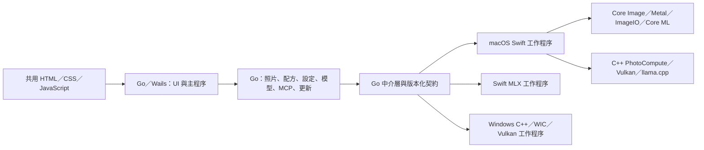

# Go 桌面宿主與跨平台進度

更新日期：2026-10-01。`run.command` 建置並開啟 **Go／Wails 主程序＋Swift／C++ 影像引擎**。此次恢復照片目錄與下方列表，並把設定、照片管理、模型管理、AI 調整、修復排程、MCP 與更新流程接回 Go 宿主。產品名稱維持 FilmDevelop，沒有開發版標示；本機安裝檔不等於已發布 Release。

macOS 目標為 Apple Silicon、macOS 14 以上。Windows 已有 x64 NSIS 安裝檔與 C++／WIC 原生入口，並在 Windows 10 實機恢復 JPEG 列表及原片預覽；**完整底片、AI／修復等流程仍待移植**，未達完整照片處理能力。

## 分工



Go 管理業務規則、資料、排程與程序生命週期；Swift／C++ 負責影像和硬體計算。MLX 使用同一套 Go 推論介面，直接呼叫既有 Swift MLX 工作程序。共用配方操作不需要啟動原生程序。

| 模組 | macOS 混合宿主現況 |
| --- | --- |
| 目錄與列表 | 選目錄、自然排序、可視縮圖、損壞檔案、空目錄、最近目錄、切換與重開恢復。 |
| 編輯 | 37 款底片、119 個控制項、裁切、完整復原／重做、白平衡滴管、校準檔、懸停預覽、設定保存、系統選單與快捷鍵。 |
| 照片與底片管理 | 自訂底片匯入／匯出／改名／複製／刪除，四語提示詞，星級、分類、EXIF、複製照片、批次套用／重設／匯出、移到垃圾桶。 |
| 模型與 AI | GGUF／MLX 探索、配對、驗證、匯入、Hugging Face 搜尋／下載／取消；完整 AI 配方在 Go 驗證並映射。 |
| 修復與主體 | Go 管理模型下載、筆刷工作、取消與紀錄；Swift 使用 Core ML／系統主體遮罩，保留高精度修復貼片。 |
| 預覽顯影 | 先顯示列表同一張縮圖，再將已套用參數的影像由 0→100% 不透明度漸進顯露；等待文字、轉圈與主體偵測取消按鈕固定在照片下方。 |
| 匯出 | JPEG、PNG、WebP、TIFF，8／16 bit 與色彩空間、尺寸、品質設定；從原圖重新計算。 |
| MCP | 本機 HTTP 服務與 12 項工具，Bearer 權杖、來源檢查、取消、編輯序列化及 UI 完成確認。 |
| 更新 | Go 查詢版本、驗證下載與平台套件；macOS 共用原有可回復安裝助手，Windows 呼叫 NSIS。 |

## 契約與資料

- `engine/contract/protocol.json` 產生 Go／Swift／C++ 傳輸型別。配方保留 schema 12，Go 支援 schema 1–12 遷移；未知版本不會靜默降級。
- `internal/recipes` 是底片預設、控制項、遷移、Web 投影及 AI 配方映射的共同來源。資料最初取自實際 Swift 產物；`prompts.json` 與 `plan.json` 保留既有提示詞契約。
- 原生端提供 capabilities、render、preview、thumbnail、whiteBalance、metadata、reveal、trash、analysis、infer、prepareRepair、repair；另有唯讀的 macOS 舊偏好設定遷移入口。原生端仍驗證傳入資料。
- 預覽透過序列 JSONL 工作階段重用目前照片的 Swift 解碼影像、編輯縮圖、主體遮罩及原圖比較。來源內容、解析器、鏡頭設定及相關參數改變時使對應快取失效；閒置 45 秒或關閉宿主時收回程序。取消時丟棄過期結果，讓 GPU 工作安全收尾，超過 30 秒才強制終止。
- Go 另外保留最近 6 份、總計最多 32 MiB 的顯影成品，切回照片／底片可直接重用；來源內容 SHA-256 與完整運算設定共同識別，快取不參與正式匯出。Web 狀態只傳送有變更的影像，重新連線會完整同步，清除照片時明確清空舊圖。
- 首次照片仍從列表縮圖以 650 ms 漸進顯影；同張照片切換底片或更新參數改用 180 ms 過渡，減少結果已完成但仍在等待動畫的時間。
- 匯出、AI 等其他原生工作使用獨立程序。stdout 僅輸出 JSONL 進度及結果，stderr 留作診斷；單則訊息上限 **64 MiB**，足以承載既有修復貼片。Go 等待工作完成或程序退出後，才清理暫存。
- 一次預覽工作共用解碼影像，回傳顯影、裁切與原圖比較結果；Web 預覽沿用舊 Swift 的 JPEG 品質 0.88。拖曳時使用 1024 px 編輯縮圖，放開後回到原有 2048 px／原尺寸運算設定；原生浮點影像計算與正式匯出精度不變。
- 拖曳持續更新影像，Go 只保留一份執行中的工作與最新待處理參數；最後縮圖完成後再補清晰圖。手勢結束才保存照片紀錄，單次參數更新只重新投影該底片。桌面橋接確認指令已入列後才送下一筆，確保最後參數、放開與換圖的順序。
- Swift 同時保留目前照片最近兩種尺寸的處理圖與原圖比較，避免反覆切換 1024／2048 px 時重新縮放。RAW 與計算加速均預設 `system`；明確選取的後端保存於 Go 設定，重啟後恢復，寫入失敗則保留原有選項。
- 加速選單由原生能力資料產生，啟動時核對持久化選項；不再提供未安裝的解析器或未通過探測的 GPU。Windows 的 `system` 先驗證 Vulkan 1.1 以上、GPU 計算能力與實際運算，再自動使用 GPU；無可用 GPU 或運算失敗時，從原圖重新執行 CPU 管線，UI 顯示實際選擇；macOS 繼續使用系統原生運算。
- PNG16／TIFF16 由原生端直接寫入，不經 Go 降成 8 bit。成品先寫入暫存，成功後以不可覆寫移動發布；MCP 明確要求覆寫時另檢查原目標是否被更動。
- 照片紀錄以**標準化路徑＋內容 SHA-256** 識別，同內容副本保持獨立。Go 使用裸雜湊，讀取原 Swift PhotoEdits 時使用含 `sha256:` 前綴的識別碼；亦相容先前 Go 的純內容紀錄，不改寫舊 Swift 資料。先前漏讀產生的「原片、無參數、歷史不完整」紀錄可自動恢復；Go 已有調整或明確重設的紀錄優先。
- 設定、自訂底片、模型選擇、提示詞、最近目錄、星級及分類分開保存。修復貼片在每張照片文件只存一份，避免在 37 款配方中重複儲存。切換照片與關閉視窗會提交前端暫存編輯；關閉要求與最後一批參數使用同一筆指令，避免事件先後順序造成漏存。
- Windows 使用 `%APPDATA%\FilmDevelop`；macOS 為保留既有資料仍使用 `~/Library/Application Support/FilmDevelop-GoDevelopment`。這是資料相容路徑，不是產品標示。`FILMDEVELOP_DATA_DIR` 可指定隔離目錄。
- `FILMDEVELOP_ENGINE` 可指定原生執行檔；一般封裝使用相對於 App 的引擎及資源位置，不依賴啟動目錄。

C++ 計算 ABI 維持頂列在前、預乘 RGBA Float32、extended-linear sRGB。這不表示 LibRaw 路徑已保留所有 RAW 高光餘量；目前軟體 RAW 仍經 RGB16 解碼。

## 建置與驗證

從儲存庫根目錄執行。需要 Go 1.25 以上、Python 3.9 以上、完整 Xcode，以及現有 C++／Vulkan 相依工具。macOS 首次建置會準備 llama.cpp 與 MLX。Windows 另需 MinGW-w64 x64、Ninja、Vulkan headers、glslangValidator、makensis／7zz。

```sh
./run.command

# 僅建置，及建立本機 macOS DMG
bash scripts/build-desktop-macos.sh
python3 scripts/package-macos.py

# Windows x64 交叉編譯、NSIS 封裝及靜態檢查
bash scripts/build-windows-installer.sh

python3 scripts/prepare-desktop.py
go -C desktop vet ./...
go -C desktop test -race ./internal/...
python3 engine/contract/generate.py --check
node --check PhotoStyleApp/Web/app.js
node --check desktop/frontend/bridge.js

python3 engine/verification/smoke.py > build/engine-smoke-latest.json
python3 engine/verification/desktop-smoke.py
python3 engine/verification/preview-cache-smoke.py
```

產物：

- `build/desktop/FilmDevelopGo.app`
- `dist/macos-arm64/FilmDevelop-<版本>-build<組建>-macos-arm64.dmg`
- `dist/windows-x64/FilmDevelop-<版本>-build<組建>-windows-x64-setup.exe`

配方移植以 **1,957 項 Swift 參考案例** 驗證。此次另執行真實原生渲染、Wails UI、MCP HTTP、實際 MLX 模型、Core ML 修復、PNG16 匯出及安裝套件驗證。逐項結果與限制見 [功能恢復紀錄](RESTORATION.md)。

完整 PhotoStyleShared 舊測試仍有 20 個失敗斷言；隔離基線確認修改前後相同，未列為整套通過。這與已通過的移植金樣本、35 項桌面及 15 項引擎 Smoke 分開記錄。

實際模型 Smoke 使用四個明確環境變數啟用，平時單元測試不下載或執行模型：`FILMDEVELOP_NATIVE_SMOKE_ENGINE`、`FILMDEVELOP_NATIVE_SMOKE_IMAGE`、`FILMDEVELOP_NATIVE_SMOKE_MODEL`、`FILMDEVELOP_NATIVE_SMOKE_REPAIR`。指定後執行 `go -C desktop test -v ./internal/application -run '^TestNativeRestoration$' -count=1 -timeout=10m`。

舊照片還原 Smoke 使用 `FILMDEVELOP_LEGACY_SMOKE_DIRECTORY`、`FILMDEVELOP_NATIVE_SMOKE_ENGINE`、`FILMDEVELOP_NATIVE_SMOKE_IMAGE`，執行 `go -C desktop test -race -v ./internal/application -run '^TestLegacyPhotoNativeSmoke$' -count=1 -timeout=4m`。可另指定 `FILMDEVELOP_LEGACY_SMOKE_GO_DATA` 唯讀複製既有空白 Go 紀錄，及 `FILMDEVELOP_LEGACY_SMOKE_OUTPUT` 保存預覽與匯出。所有還原紀錄寫入隔離測試目錄，原圖和 Swift 資料只讀。

預覽效能量測使用 `FILMDEVELOP_PERF_ENGINE`、`FILMDEVELOP_PERF_IMAGE`、`FILMDEVELOP_PERF_OUTPUT`，執行 `go -C desktop test -v ./internal/application -run '^TestPreviewPerformanceSmoke$' -count=1 -timeout=5m`；分別測量編輯縮圖與原尺寸模式的開圖、切換底片及連續曝光調整，所有紀錄寫入隔離目錄。結果見 [`preview-performance-report.json`](../build/preview-performance-report.json)。

真實滑桿量測與順序驗證：`python3 engine/verification/editing-preview-smoke.py /照片絕對路徑.NEF --verify --report build/editing-preview-after.json`。改用 `--preferences` 會以同一隔離資料目錄啟動兩次，驗證系統預設與加速選項持久化。量測使用非 race 建置；一般桌面 Smoke 仍使用 race。結果與限制見 [`editing-performance-report.json`](../build/editing-performance-report.json)。

照片／底片切換的完整 UI 量測使用 `python3 engine/verification/preview-navigation-smoke.py <照片一> <照片二> --report <報告.json>`。兩張原檔只讀並複製到隔離目錄，記錄指令送出至結果抵達、影像解碼與動畫完成的時間，另確認切回時的成品一致。量測不使用 race 插樁；結果見 [`preview-navigation-report.json`](../build/preview-navigation-report.json)。

## Swift 整理

`run.command` 不再建置或啟動舊 SwiftUI 桌面。catalog、normalizeRecipe、editRecipe、projectRecipes 已從 Swift RPC 移除，改由 Go 提供。

原應用儲存器與 Web 投影已隔離至 `LegacyStyleAdjustmentStore.swift`；混合 App 不編譯此相容檔，也不編譯舊 WebCoordinator、模型管理、MCP、更新管理及原生 UI 映射。共用 LLM 與影像分析來源使用 `FILMDEVELOP_GO_HOST` 排除舊提示詞／AI 業務編排，只提供 Go 所需的推論與像素分析。裁切預覽的配方方法移至原生資料模型，解除對舊 UI 協調器的依賴。

舊 Xcode 桌面與測試保留作相容性比對，不參與混合 App 執行。`PhotoStyle.swift` 保留影像模型與輸入驗證，`PhotoStyleShared` 保留 Core Image／Metal／Core ML 演算法。

## Windows 與 Release 門檻

Windows x64 的 16 個 PE 產物與 9 項封裝檢查已可在本機執行。已附 `filmdevelop-engine.exe`，使用 WIC 解碼、EXIF／ICC、原片的印相曝光／顯影／藥水／掃描及 sRGB JPEG、PNG／TIFF 16 bit 輸出。Windows 10 實機的 JPEG 列表／預覽與 Vulkan 計算圖已執行；兩項要求 Vulkan validation layer 的除錯測試仍缺執行環境。靜態封裝旗標不自動承襲實機結果，詳細實機證據另外保存在 `build/windows-native-runtime-report.json`。

尚需完成 Windows 的完整底片、數位色調、AI／修復、裁切／裝飾及更多輸出色彩空間，再做跨平台影像金樣本比較。WIC RAW 使用系統解析器的顯影輸出，不能宣稱與 Swift 的場景線性 RAW 等價。WIC 不支援來源時，Windows 會使用與 macOS 共用的 PhotoRAW／LibRaw 0.22.2；其 RGB16 高光及鏡頭校正限制仍須保留。現有 PhotoCompute 僅涵蓋部分運算階段，不能當作完整 Windows 照片編輯器發布；亦仍需 Windows 11、缺少 WebView2、離線及不同 GPU 驅動測試。

本機 macOS App 使用 ad-hoc 簽章，DMG 尚未公證；此次沒有發布 Release。GGUF 圖文推論尚未以實際 GGUF 模型驗證，實際 AI Smoke 使用 MLX。更新器驗證及準備本機套件，不代表正式 Release 線上更新已驗收。Windows 安裝配置見 [封裝說明](../packaging/windows/README.md)。
